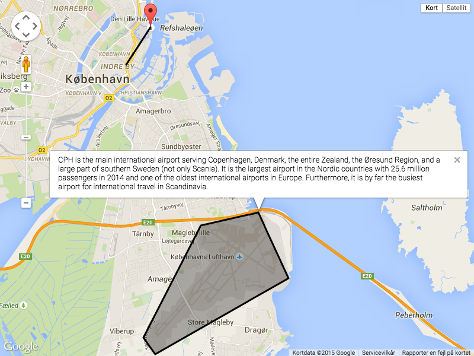
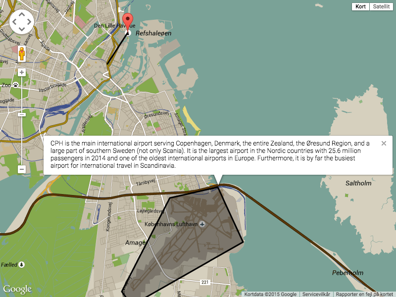
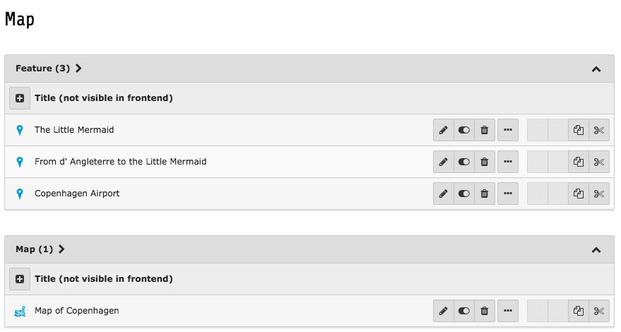

.. ==================================================
.. FOR YOUR INFORMATION
.. --------------------------------------------------
.. -*- coding: utf-8 -*- with BOM.

.. include:: ../Includes.txt

What does it do?
================

Cartography helps you genreate clean GeoJSON and diplay interactive frontend maps. The extension has two main puposes:

1. Construct maps with points, lines, polygons and infowindows and generate clean GeoJSON.
2. Use GeoJSON to display interactive maps in the frontend using a map provider, eg Google Maps or Google Maps with Snazzy styles.

Screenshots
===========
Frontend Map - Google Maps example
----------------------------------

Frontend Map - Snazzy Maps example
----------------------------------

Backend Map
-----------
