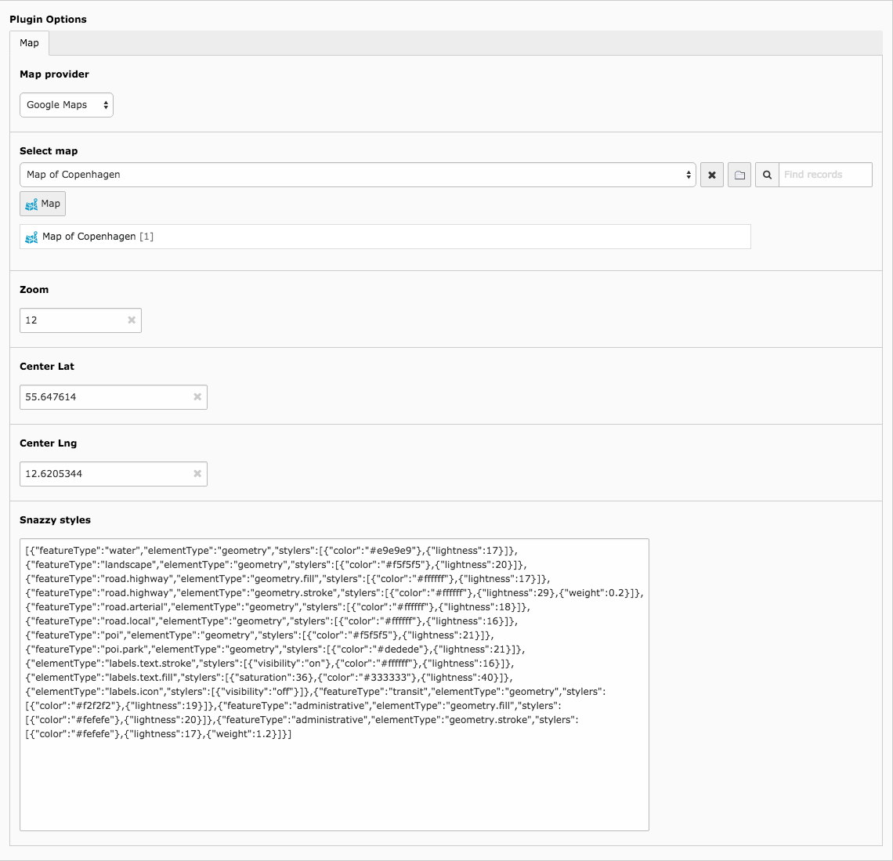

.. ==================================================
.. FOR YOUR INFORMATION
.. --------------------------------------------------
.. -*- coding: utf-8 -*- with BOM.

.. include:: ../Includes.txt

.. _users-manual:

Users manual
============

Creating a map is usually split into two main steps. First step is to construct a map with points, lines, polygons and infowindows. Second step is to insert a map plugin on a page, select a map provider, and set various settings for the map plugin.

You can reuse maps, points, lines, polygons, etc. You can use the same map multiple times, but display it in different ways depending on map provider or other map plugin settings.

You may not even need to use the map plugin at all, but simply use the extension to manage GeoJSON for other extensions or external systems.

Hopefully your options will be more clear in a moment.

Construct map
-------------
First step is to create a folder to store map data. Any existing system folder can be used to store map data, but for your own sake and to keep things organized it is recommended that you create a new clean system folder in the backend.

Maps
^^^^
A good place to start is to create a new map. This is done by selecting the List module, clicking "Insert new record" and selecting the "Map" record type below the Cartography headline. Select an appropriate title for your map and save. The title is only used in the backend.

Features
^^^^^^^^
Unless you want a completely useless map you'll need to add some features to your map. Create a new feature by using the List module, clicking "Insert new record" and selecting the "Feature" record type below the Cartography headline. You can select three different types of features:

1. Point
2. Line
3. Polygon

A **point** is the most basic feature you can add to a map. A point has a **title**, a set of **coordinates**, **information** and references to **maps**. The **title** is just to help keep things organized, it is now shown in the frontend. A set of **coordinates** is longitude, latitude and altitude (altitude is optional). In contrast to line and polygon, a point only has one set of coordinates. The **information** field holds the text that should be displayed when a user clicks the point on the map. Finally you have a list of references to **maps** where the feature is used. You can use the same feature on multiple maps.

A **line** has the same features as a point but it requires an extra set of coordinates. The first set of coordinates is the line's starting point and the second is the line's stopping point.

A **polygon** has the same features as a point but it requires three sets of coordinates. The first set of coordinates is the start and stopping point and the rest of the coordinates make up the shape of the polygon.

Insert map plugin
-----------------

In order to display a map, the Map plugin should be added as content on a page. Select the Page module, click "Create new content element", "Insert plugin" and select "Map" in the dropdown. After saving, options for the map plugin will be displayed. Following options are available:

- Map provider: Dropdown of possible map providers (only Google Maps is available currently).
- Select map: Search or select a map record.
- Width (optional): Set the width of the map (defaults to 600px). Can be set in px or % (200px / 100%).
- Height (optional): Set the height of the map (defaults to 600px). Can be set in px or % (200px / 100%).
- Zoom (optional): Initial zoom level on map
- Center latitude (optional): Initial map center latitude (if not set center will be Denmark).
- Center longitude (optional): Initial map center longitude (if not set center will be Denmark).
- Snazzy styles (optional): Go to snazzymaps.com, find a nice snazzy style, copy the JavaScript Style Array and paste it in the field.

Example of map plugin settings
^^^^^^^^^^^^^^^^^^^^^^^^^^^^^^
